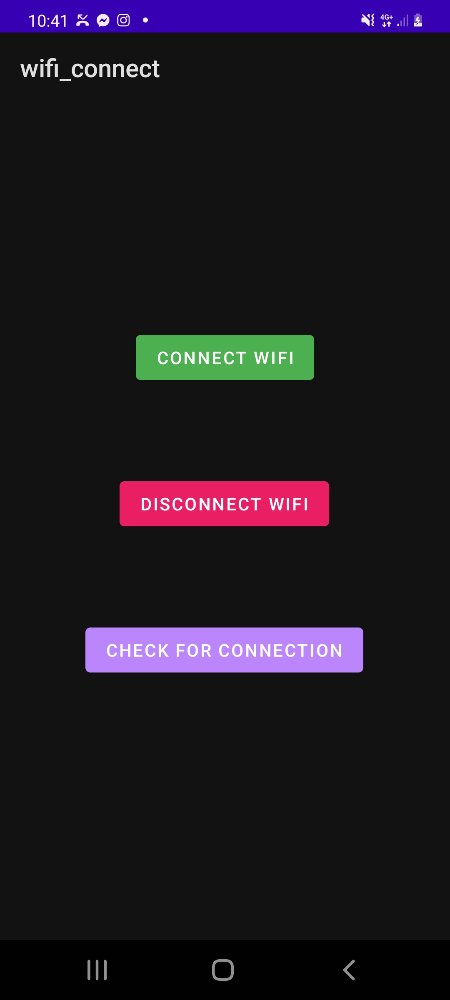
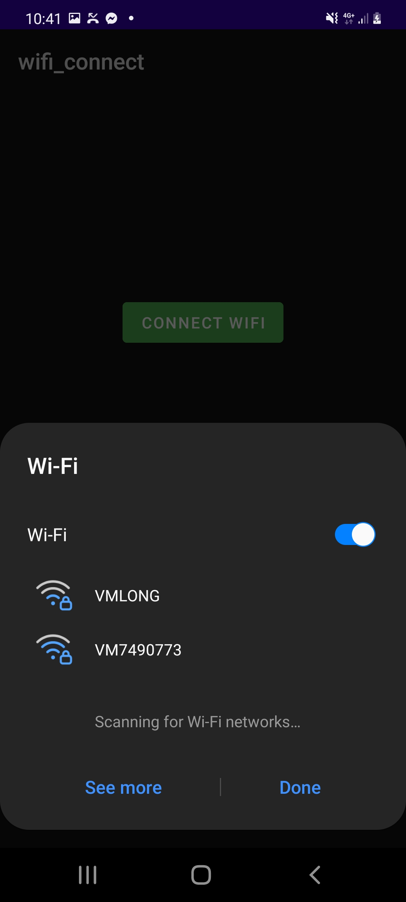
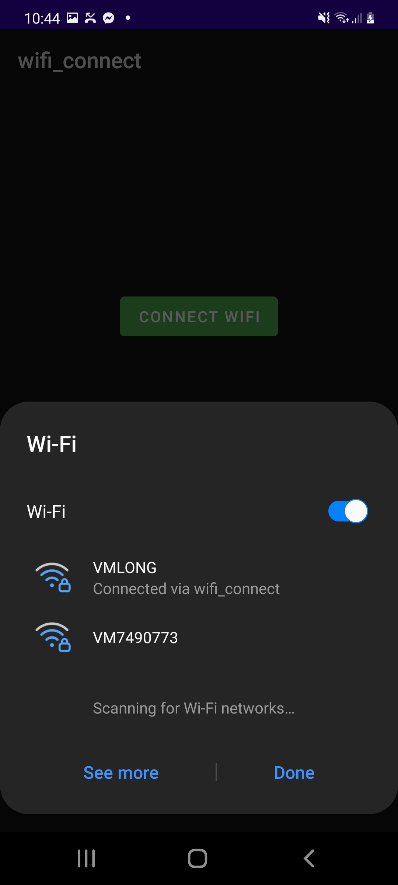

## Purpose

A simple app which allows the user to connect a physical Android device to a home Wi-Fi router

## Software/Hardware prerequisites for using App

#### Software:

- Android Studio

#### Hardware:

- Physical Android Device (running at least Android 10)
- Micro-USB cable
- USB port

## App Configuration

After cloning the repository the user needs to open the project in Android Studio and create an environment_variables.xml file to store their router's SSID and PASSWORD. This file is included in the .gitignore to ensure sensitive data isn't pushed to a repository.

  1) Navigate to the following folder - /app/src/main/res/values (it should already contain colors.xml and strings.xml files) 
  
  2) Create a file called environment_variables.xml
  
  3) Paste the following code below:

```

<?xml version="1.0" encoding="utf-8"?>
<resources>
    <string name="SSID">insertSSID</string>
    <string name="SSID_PASSWORD">insertPASSWORD</string>
</resources>

```
4) Replace insertSSID and insertPASSWORD with your home router's SSID and PASSWORD

## Using App

  1) Open the project on Android Studio and follow the steps listed there to install the app on a physical device via Micro-USB cable -          https://developer.android.com/studio/run/device
  
  2) After app installation, disconnect the device from a network if it is connected to one
  
  3) Open the app and allow suggested Wi-Fi networks:
  
<p align="center">
  
</p>
  
  4) Press Connect Wi-Fi
  
  5) The Wi-Fi Setting Panel should pop up:
  
<p align="center">
  
</p>
  
  6) Wait until the target network appears in the network suggestions. The device may auto-connect to the target network and if so, proceed to step 8
  
  7) Press on the target network to attempt connection
  
  **There is a known bug with the application which may prompt the user to enter the SSID and PASSWORD manually. If this happens, press Cancel and repeat steps 6-7*
  
  8) If a successful connection via the app is made, the device should connect to the target network. A message will appear which states that the device is connected via app:
  
<p align="center">
  
</p>
  
  
